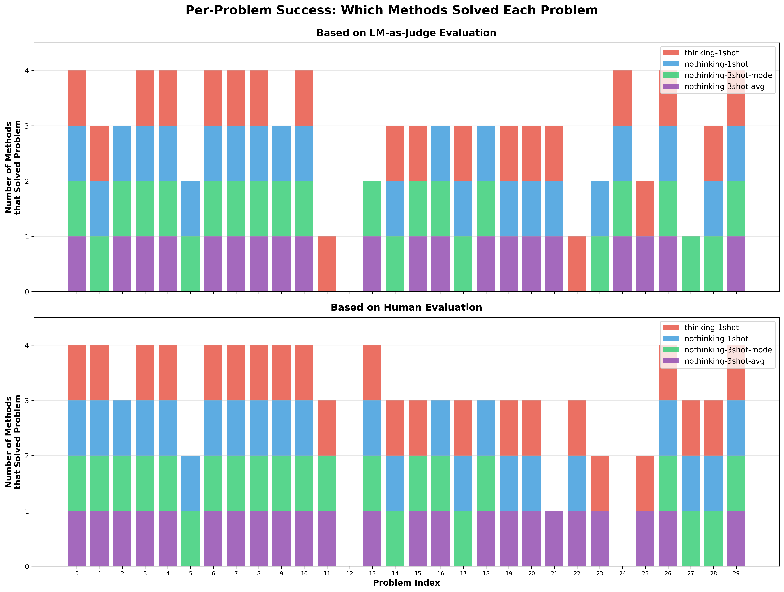

# Setup
Make sure you read the `README.md` file first. To run the benchmark, make sure you have installed uv and have activated the virtual environment. Then, 
run `cp .env.example .env` and then plug in the appropriate environment variables in `.env`to configure the judge LM. See the Configuration section in README.md to see how to set the ENSEMBLE, AGGREGATION, THINKING, SERVER_URL, API_TOKEN, and MODEL parameters. To run the benchmark, you will also have to set
* LM_AS_JUDGE_SERVER_URL: The URL of the server to use for making LM calls for the judge
* LM_AS_JUDGE_API_TOKEN: The API key to use for making LM calls for the judge
* LM_AS_JUDGE_MODEL: The model to use for making LM calls for the judge
The LM judge server URL and model have been set to GPT-5 by default, but you can use any OpenAI-compatible server. You will also have to provide your own API key.
```
time uv run tests/benchmark_lm_score.py --prefix run1
```
# Experimental design
We use the 30 rows from the company.db database as a benchmark. The database has 3 tables "EMAILS", "INVOICES", and "SALES_LEADS". Each table has 10 rows. Each set of 5 rows is assigned a question that is asked in the `LM_SCORE` function. 

Scoring is based on the reasonability of answers. I evaluated each table in the database myself and with an LM-as-judge (GPT-5 via the API). 

The correctness of the LM's output score was based on the human evaluation and the LM-as-judge. Correctness was based on whether or not the output score was reasonable.

Results and error bars are based on just a single run.
## Head of email table in database
The tables below show examples of rows in the database.
  | id  | email                | subject                   | body                                                  |
  |-----|----------------------|---------------------------|-------------------------------------------------------|
  | 1   | john.doe@example.com | Welcome to our service    | Thank you for signing up! We're excited to have yo... |
  | 2   | jane.smith@example.c | Your order has been shipp | Great news! Your order #12345 has been shipped and... |
  | 3   | support@company.com  | Password reset request    | We received a request to reset your password. If y... |
  | 4   | newsletter@tech.com  | This week in technology   | Here are the top tech stories of the week: AI brea... |
  | 5   | billing@service.com  | Invoice for January 2025  | Your invoice for January 2025 is ready. Amount due... |

| id | customer             | product             | amount   | description                                      |
|----|----------------------|---------------------|----------|--------------------------------------------------|
| 1  | Acme Corp            | Software License    | 1999.99  | Annual enterprise software license renewal       |
| 2  | Tech Startup Inc     | Consulting Services | 5500.0   | Technical consulting for cloud migration project |
| 3  | Global Solutions LLC | Hardware Equipment  | 12500.0  | 10 workstations and networking equipment         |
| 4  | Digital Media Co     | Web Development     | 8750.0   | Custom website development and design            |
| 5  | Retail Chain Ltd     | POS System          | 15000.0  | Point of sale system for 5 locations             |
## Examples of judgement
The LM judge and I labeled this as correct:
```python
subject = Green Energy Partners
body = "Looking for data analytics platform to track renewable energy production"
question = "Is this lead interested in cloud or SaaS solutions?"
LM_SCORE(subject, body, question)
```
The LM judge and I labeled this as incorrect:
```python
subject = "Security Audit"
body = "Cybersecurity assessment and compliance review"
question = "Is this invoice for a service or consulting engagement?"
LM_SCORE(subject, body, question)
```
## Example where LM-judge and human evaluation disagreed
```python
subject = "Urban Development Group"
body = "Need project management software for construction projects"
question = "Is this lead interested in cloud or SaaS solutions?"
LM_SCORE(subject, body, question)
```
# Results

