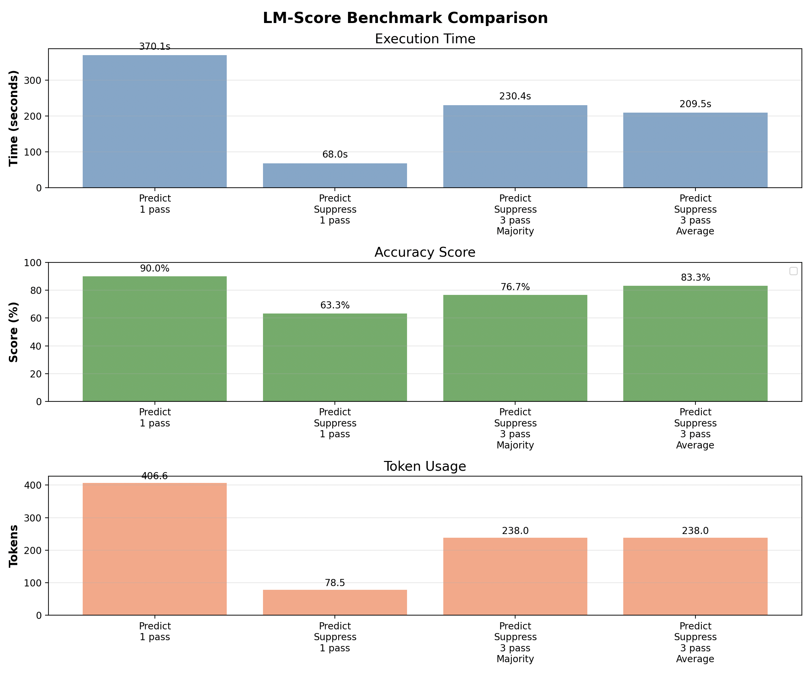

## Setup
For running locally, simply run 
```zsh
mlx_lm.server --model "mlx-community/DeepSeek-R1-Distill-Qwen-7B-4bit"
```
on Mac.
To suppress the thinking tokens, run 
```zsh
mlx_lm.server \
    --model "mlx-community/DeepSeek-R1-Distill-Qwen-7B-4bit" \
    --max-tokens 4000 \
    --chat-template "$(cat src/server/chat.template)"
```

To run from another OpenAI-compatible server, simply update the SERVER_URL and API_KEY fields
in .env.

To set up the client, install `uv`.
1. Run `uv venv && source .venv/bin/activate` 
2. Once you have the server running, you can run a smoke test to make sure everything is working correctly.
```
time uv run tests/benchmark_lm_score.py
```

### Example usage
Run the following in your terminal:
```zsh
uv run python -i src/lm_score/lm_score.py
```
Now that you are in the python interactive environment, you can run one of the examples that is displayed to make SQL queries that utilize the LM_SCORE function that we've defined.

## Experiments
Scoring is based on subjective reasonability of answers. I label every score as either "reasonable" or "unreasonable".

Run `uv run python analysis/viz.py` for a visualization of these results.


## AI tools
Registering LM_SCORE in SQL.

Created company.db database.

Created docstrings for functions.

Ran benchmarking script.

Visualizing bar plots for benchmarking.


## Future steps
* Optimize prompt with DSPy
* Making LM calls async
* mlx_lm.server doesn't support continuous batching yet, so should be able to speed up async calls more.
